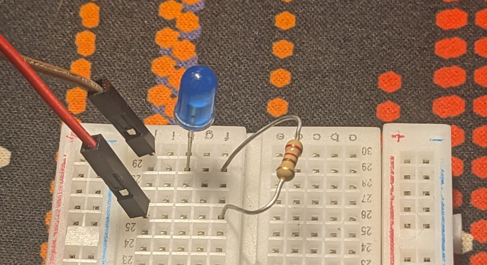
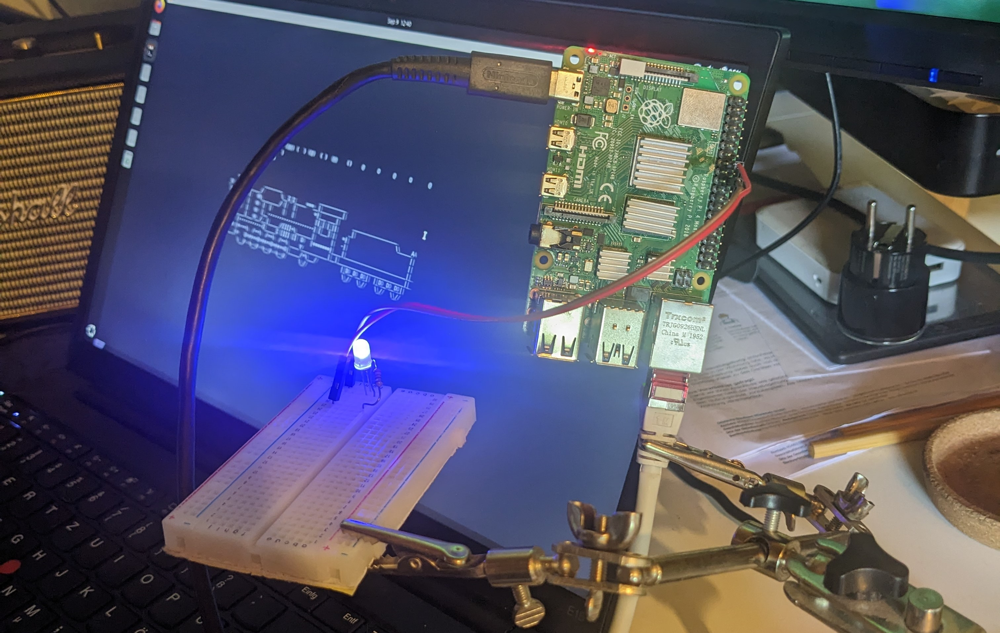
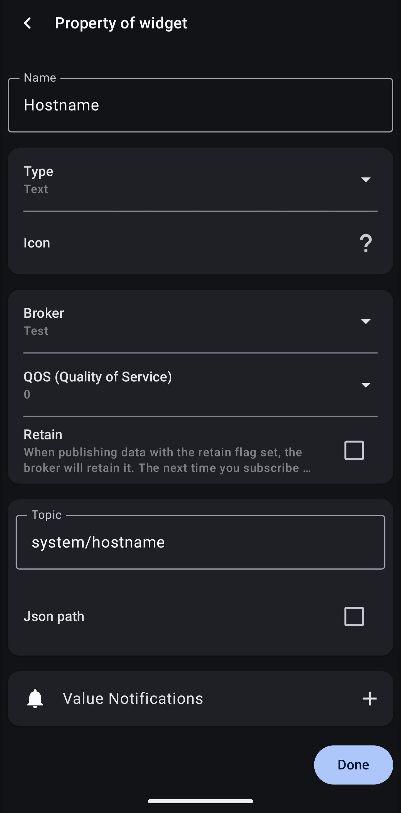
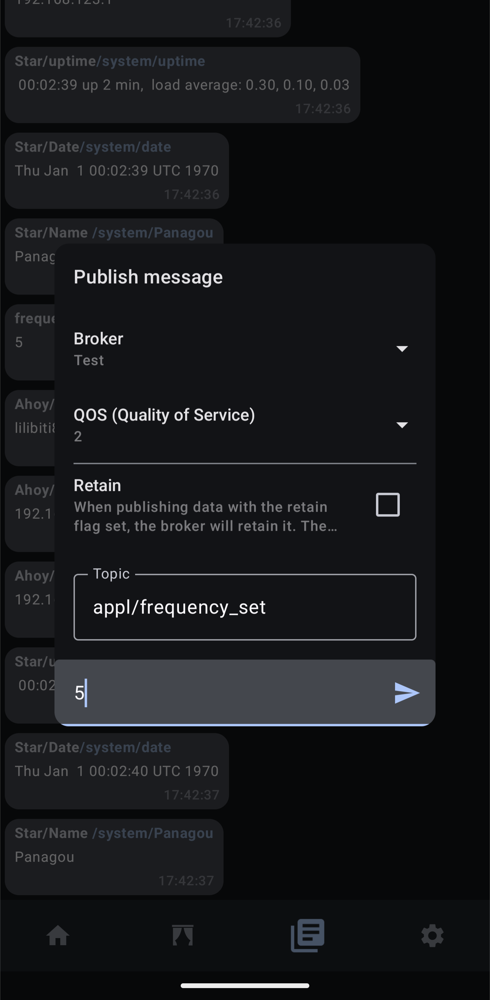
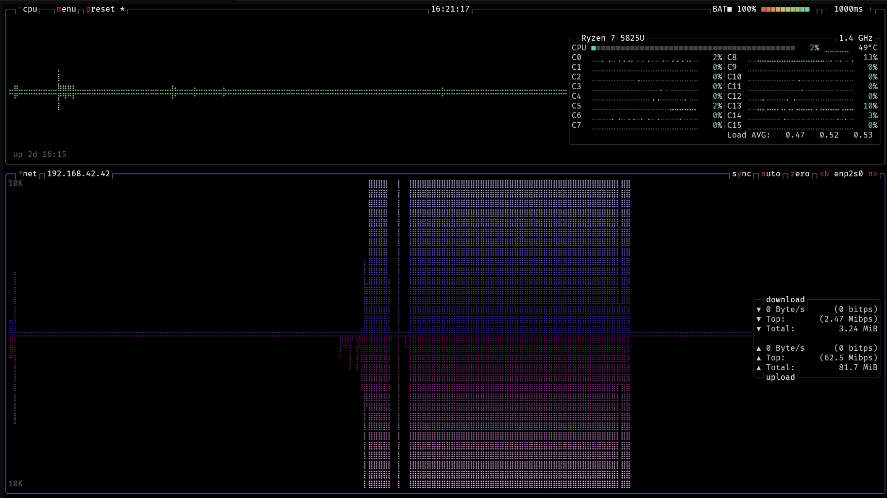
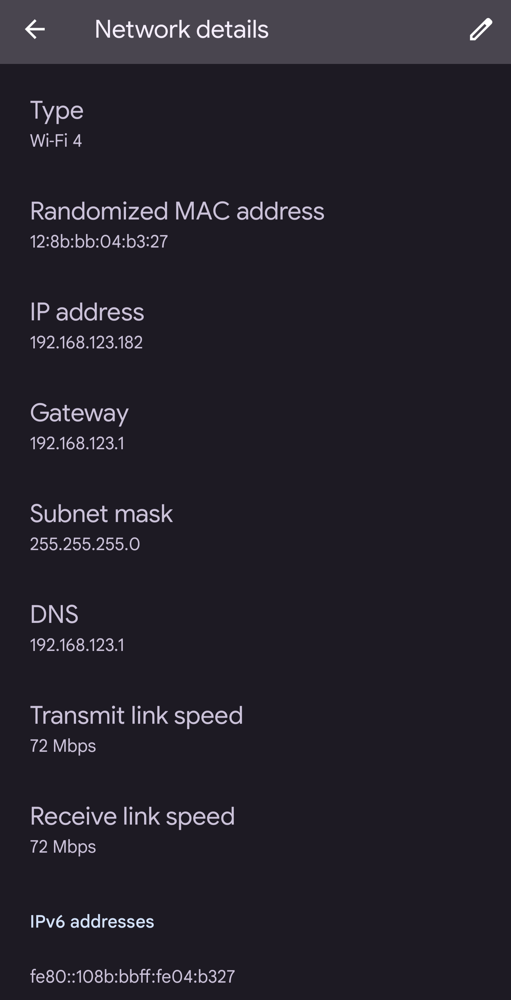
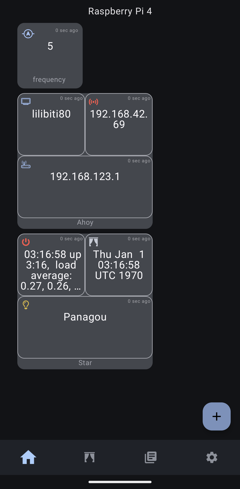

BOOT_UART=1
TFTP_IP=192.168.42.42
TFTP_PREFIX=1
TFTP_PREFIX_STR=
BOOT_ORDER=0x12
CLIENT_IP=192.168.42.69
SUBNET=255.255.255.0
```
<br> 

Nach einem Reboot sollte der Raspberry Pi bereit für den Netzwerkboot sein und die SD-Karte wird nicht mehr benötigt.

## Konfiguration des TFTP-Servers

Im nächsten Schritt muss nun der Entwicklungsrechner für den Netzwerkboot konfiguriert werden.  
Dazu wird der TFTP-Server verwendet.  
  
Zunächst müssen diverse Bootdateien hinzugefügt werden:
<br>  

```bash
wget https://github.com/raspberrypi/firmware/archive/master.zip
unzip master.zip
sudo cp -r firmware-master/boot/* /srv/tftp/
chmod -R 755 /srv/tftp/
```
<br> 

Des Weiteren muss die `config.txt` in das `/srv/tftp/`-Verzeichnis kopiert werden.  
<br>  

```bash
sudo cp scripts/config.txt /srv/tftp
```
<br> 

## Konfiguration von Buildroot und des Linux-Kernel

Im Folgenden wird das Erstellen des Linux Kernel und des Filesystems per Buildroot konfiguriert.  
  
Zunächst wird der Linux-Kernel betrachtet. Diese Installationsanleitung befasst sich mit der Kernelversion `6.11`.  
Nachdem das Git-Repository heruntergeladen wurde, muss in den entsprechenden Branch für die Kernelversion gewechselt werden. Danach kann die bereitgestellte Konfigurationsdatei verwendet werden, um den Kernel zu kompilieren.   
<br>  

```bash
git clone https://github.com/raspberrypi/linux.git
source scripts/export.sh
cd linux
git checkout rpi-6.11.y
make bcm2711_defconfig
cp ../configs/config.linux ./.config
make menuconfig # <- nur öffnen, speichern und direkt wieder schließen
make -j16 zImage dtbs modules
```
<br> 

Die Kompilierung kann je nach Rechner fünf bis 45 Minuten dauern.  
Ist die Kompilierung erfolgreich abgeschlossen, kann das Kernel-Image in das TFTP-Verzeichnis kopiert werden.  
<br>  

```bash
cp arch/arm/boot/zImage /srv/tftp/kernel7l.img
```
<br> 

Darauf folgend wird Buildroot konfiguriert.  
Es muss erneut zunächst das Git-Repository heruntergeladen werden. Danach kann Buildroot mittels der beigelegten Konfigurationsdatei und weiteren Skripten kompiliert und vollständig konfiguriert werden.  
<br>  

```bash
git clone https://github.com/buildroot/buildroot.git
cd buildroot
make raspberrypi4_defconfig
cp ../configs/config.buildroot ./.config
make menuconfig # <- nur öffnen, speichern und direkt wieder schließen
make -j16
```
<br> 

Nun sollten alle Dateien und Konfiguration vorhanden sein, um den Raspberry Pi starten zu können.

## Hardwareaufbau und anschließen der LED

Der Raspberry Pi muss mit einem LAN-Kabel mit dem Entwicklungsrechner verbunden sein.  
Außerdem ist es notwendig, die LED an GPIO-Pin 23 des Pi anzuschließen. In den nachfolgenden Bildern ist die rote Leitung mit Pin 23, das braune mit einen Ground-Pin verbunden.


  
{ height=400px}

## Konfiguration der MQTT-App

Im letzten Schritt muss nun nur noch die MQTT-APP zum Erhalten der Topics konfiguriert werden. 
Dabei wird die Konfiguration für die App `MQTT Dashboard Client` auf Android beschrieben.  

Durch Antippen des `+`-Symbol kann ein neues Widget hinzugefügt werden. Im darauf folgendem Menü ist es anschließend möglich, ein Topic unter den Parametern hinzuzufügen.

{height=325px}

Dieser Vorgang kann für alle veröffentlichten Topics wiederholt werden (Siehe Aufgabenstellung).  
Um die Frequenz der LED zu ändern, kann wie im folgenden Screenshot eine Nachricht an den Pi über das entsprechende Topic gesendet werden.  

{ height=325px}

\pagebreak

# Systemtest

## Komponententest

Bevor das Gesamtsystem getestet wird, werden zunächst die einzelnen Komponenten größtenteils unabhängig voneinander auf Funktionalität und korrekte Konfiguration getestet.  
Ziel ist es festzustellen, ob alle geforderten Aufgaben und die Individualisierung erfüllt wurden. 

Für die folgenden Tests ist das System wie in `Kapitel 4: Installationsanleitung` beschrieben, aufgebaut und konfiguriert.  

### Grundkonfiguration des Raspberry Pi 4  

In diesem Abschnitt wird die Grundkonfiguration des Raspberry Pi 4 getestet. Diese umfasst die korrekte Konfiguration:  
  
- Des Networkboot per TFTP
- Des Hostnames
- Der User
- Des LAN-Port `eth0`
- Des SSH-Servers

---

Der Pi wird durch Anschließen des Stromkabels gestartet. Auf dem Hostrechner kann durch die Netzwerkauslastung am LAN-Port beobachtet werden, ob der TFTP-Server die Daten für den Raspberry Pi zur Verfügung stellt. Dafür geeignet sind Programme wie `btop`:
  
{ height=300px }  
  
Des Weiteren kann der Output des Befehls `tail -f /var/log/syslog | grep tftp` Schlüsse auf die korrekte Funktionsweise des TFTP-Servers geben. 

Nachdem der Pi gestartet wurde, kann versucht werden, sich über SSH auf diesem einzuloggen.
Dabei wird als User `Panagou` und als IP-Adresse `192.168.42.69` angegeben. Wird die Verbindung erfolgreich aufgebaut, kann sich mit dem Passwort `Qbobhpv` eingeloggt werden.  
<br>  

```bash
nemdos@ThinkpadUbuntu ~ $ ssh Panagou@192.168.42.69
Panagou@192.168.42.69`s password: Qbobhpv 
```
<br> 
Nach dem Einloggen kann durch den Befehl `hostname` die Konfiguration des Hostnames überprüft werden.

```bash
$ hostname
lilibiti80 
```

### Konfiguration des Access-Points über den Raspberry Pi 4

In diesem Abschnitt wird die Konfiguration des Raspberry Pi 4 als Access-Point getestet. Diese umfasst:  
  
- Das erfolgreiche Aufspannen des WLAN-Netzes
- Den Namen und das Passwort des Netzes
- Der Adressraum des Netzes
- Die Konfiguration des `wlan0`-Interfaces

---

Durch Aufrufen des Befehls `ifconfig wlan0` ist es möglich, die Konfiguration des Interfaces einzusehen.  
<br>

```bash
$ ifconfig wlan0
wlan0     Link encap:Ethernet  HWaddr DC:A6:32:9B:B1:30  
          inet addr:192.168.123.1  Bcast:192.168.123.255  Mask:255.255.255.0
          inet6 addr: fe80::dea6:32ff:fe9b:b130/64 Scope:Link
          UP BROADCAST RUNNING MULTICAST  MTU:1500  Metric:1
          RX packets:0 errors:0 dropped:0 overruns:0 frame:0
          TX packets:12 errors:0 dropped:0 overruns:0 carrier:0
          collisions:0 txqueuelen:1000 
          RX bytes:0 (0.0 B)  TX bytes:936 (936.0 B)
```  
<br>  

Ob das WLAN-Netz korrekt aufspannt wurde, lässt allerdings direkt mit dem Smartphone testen. Dazu wird mit diesem versucht, sich mit dem Netz zu verbinden.  
Nach Öffnen der WLAN-Einstellungen des Smartphone sollte das WLAN-Netz auswählbar und mittels des Passwortes `ancprcuuaq` nutzbar sein.  
  
In der Detailansicht der WLAN-Verbindung kann nun überprüft werden, ob der der AP des Pi korrekt Adressen aus dem Netz `192.168.123.0/24` verteilt.

{ height=450px }


### Konfiguration des Gerätetreibers und Ansteuerung der LED

In diesem Abschnitt wird die Funktionalität und Ansteuerung der LED über den Gerätetreiber `signalan` getestet. Dies beinhaltet:  
  
- Der Gerätetreiber wird während des Hochfahrens des Systems geladen
- Die Gerätedatei wird automatisch angelegt 
- Durch lesen des Gerätetreibers kann die aktuelle Blinkfrequenz der LED ausgelesen werden
- Durch schreiben des Gerätetreibers kann die aktuelle Blinkfrequenz der LED geändert werden 

---

Ob der Gerätetreiber erfolgreich geladen wurde, lässt sich einfach mittels des Befehls `lsmod` ermitteln. War das Laden erfolgreich, so wird der Gerätetreiber in der Ausgabe aufgelistet.  
<br>

```bash
$ lsmod
Module                  Size  Used by
signalan               12288  0
ipv6                  528384  32
```  
<br>  

Ähnliches Vorgehen kann das Anlegen der Gerätedatei überprüfen. Dazu wird der Befehl `ls /dev/ | grep led_onoff_an` verwendet. Dieser listet alle Gerätedateien des Systems auf und sucht darin nach der speziellen Gerätedatei. Falls die Gerätedatei nicht angelegt wurde, gibt dieser Aufruf nichts zurück.  
<br>

```bash
$ ls /dev/ | grep led_onoff_an
led_onoff_an
```  
<br>  

Um das Lesen und Schreiben auf der Gerätedatei testen zu können ist es notwendig sich mit dem root-User einzuloggen.   
<br>

```bash
$ su
Password: root
```  
<br>  

Nun kann die Frequenz der LED aus der Gerätedatei ausgelesen, anschließend geändert und abschließend erneut ausgelesen werden. Dabei sollte die LED an GPIO-Pin 23 des Raspberry Pi angeschlossen sein, um eine visuelle Bestätigung der Änderung der Blinkfrequenz bieten zu können.  
<br>

```bash
$ cat /dev/led_onoff_an 
1
$ echo -e -n "\x05" >/dev/led_onoff_an
$ cat /dev/led_onoff_an 
5
```  
<br>  

\pagebreak

### Konfiguration Mosquitto und MQTT-App

In diesem Abschnitt wird die korrekte Konfiguration von Mosquitto und der MQTT-App betrachtet. Dies schließt folgende Aspekte ein:  
  
- Mosquitto wird beim Hochfahren des Systems automatisch gestartet
- Mosquitto veröffentlicht regelmäßig mehrere Topics, die verschiedene Systeminformationen beinhalten
- Die MQTT-App ist in der Lage die Frequenz der LED über das Topic `appl/frequency_set` 

---

Wie bei den bereits vorangegangen Tests kann das Starten von `mosquitto` durch einen Befehl überprüft werden. `ps | grep mos` gibt eine Liste der momentan laufenden Programme zurück, welche durch den `grep`-Befehl auf die mit `mosq` im Namen gefiltert werden.  
<br>

```bash
$ ps | grep mosq
  166 mosquitt /usr/sbin/mosquitto -c /etc/mosquitto/mosquitto.conf
  182 root     sh /etc/init.d/mosq_pub.sh
  185 root     mosquitto_sub -t appl/frequency_set
  ...
```  
<br>  

Um zu überprüfen, ob die Topics erfolgreich veröffentlicht werden, kann erneut das Smartphone verwendet werden. Dafür wird sichergestellt, dass dieses mit dem WLAN-Netzwerk des Raspberry Pi verbunden ist. Anschließend kann die MQTT-App geöffnet und die eingerichteten Topics beobachtet werden. Diese sollten sich regelmäßig aktualisieren. Des Weiteren kann hier das setzen einer neuen Blinkfrequenz über die App getestet werden. Wenn das entsprechende Topic eingerichtet ist, sollte ein Antippen genügen, um die LED steuern zu können.

{ height=450px }

Hierbei gibt es eine Auffälligkeit bei dem Topic `system/date`. Das angezeigte Datum und die Uhrzeit sind nicht korrekt. Dies lässt sich allerdings einfach dadurch erklären, dass der Raspberry Pi aktuell keine Verbindung zum Internet besitzt. Die Verbindung ist Notwendig, um das korrekte Datum und die korrekte Uhrzeit setzen zu können.

\pagebreak

## Test des Gesamtsystems

Nach den Tests der einzelnen Komponenten, folgt nun der Test des Gesamtsystems.  
Ziel dieses Tests ist es, festzustellen, ob alle Komponenten korrekt miteinander interagieren.  
Die Funktionalität der einzelnen Komponenten, wie dem Gerätetreiber und dem MQTT-Broker, müssen nicht nur in isolierten Tests, sondern auch im normalen Betrieb problemlos funktionieren.  
  
Das System ist wie in `Kapitel 4: Installationsanleitung` beschrieben aufgebaut und konfiguriert.  
  
- Die LED ist mit GPIO-Pin 23 verbunden
- Das aufgespannte WLAN-Netz trägt den Namen `VimIsTheBest` und vergibt Adressen aus dem Netz `192.168.123.0/24`
- Die MQTT-App ist zum Empfangen und Verschicken aller Topics korrekt konfiguriert

### Testdurchführung

Der Raspberry Pi 4 wird durch anschließen des Stromkabels eingeschaltet.  
Ob der Netzworkboot erfolgreich war, ist anhand der LED feststellbar.
Fängt diese nach dem Hochfahren an auf der niedrigsten Geschwindigkeit zu blinken, war das Booten per TFTP erfolgreich.  
   
Im nächsten Schritt wird die WLAN-Verbindung mit dem Smartphone hergestellt. Dazu wird das WLAN-Menü des Smartphones geöffnet und durch Antippen des Eintrags `VimIsTheBest` eine Verbindung hergestellt. Sobald die Verbindung aufgebaut wurde, kann die MQTT-App geöffnet werden.  
  
Auf dem Dashboard sollten nun alle Topics einsehbar sein. Im Folgenden kann nun getestet werden, ob durch versenden des Topics `appl/frequency_set` die Blinkfrequenz der LED gesteuert werden kann.

\pagebreak

# Zusammenfassung

In dieser Projektarbeit wurde ein eingebettetes System basierend auf einem Raspberry Pi 4 entwickelt, das per TFTP über das Netzwerk bootet und verschiedene Funktionen bereitstellt. Die Kernaufgaben umfassten die Konfiguration eines Networkboots, die Implementierung eines Gerätetreibers zur Ansteuerung einer LED und die Einrichtung eines MQTT-Brokers, der die Kommunikation mit einer MQTT-App auf einem Smartphone ermöglicht.  
  
Die abschließenden Komponenten- und Systemtests zeigen, dass alle Komponenten wie angefordert funktionieren und das Gesamtsystem stabil lief. 

Ein Aspekt, welcher in zukünftiger Weiterentwicklung fortgeführt werden kann ist den Pi mit einer Internetverbindung auszustatten.  
Sollte dies erfolgreich implementiert werden, so wäre es möglich das Datum und die Uhrzeit auf dem Pi korrekt zu konfigurieren. 

\pagebreak

# Quellen- und Literaturverzeichnis

- The Buildroot user manual, 2024.  
  [https://buildroot.org/downloads/manual/manual.pdf](https://buildroot.org/downloads/manual/manual.pdf)

Neben den Unterlagen, welche durch die Vorlesung auf Moodle zur Verfügung standen, wurden keine
weiteren Quellen genutzt.