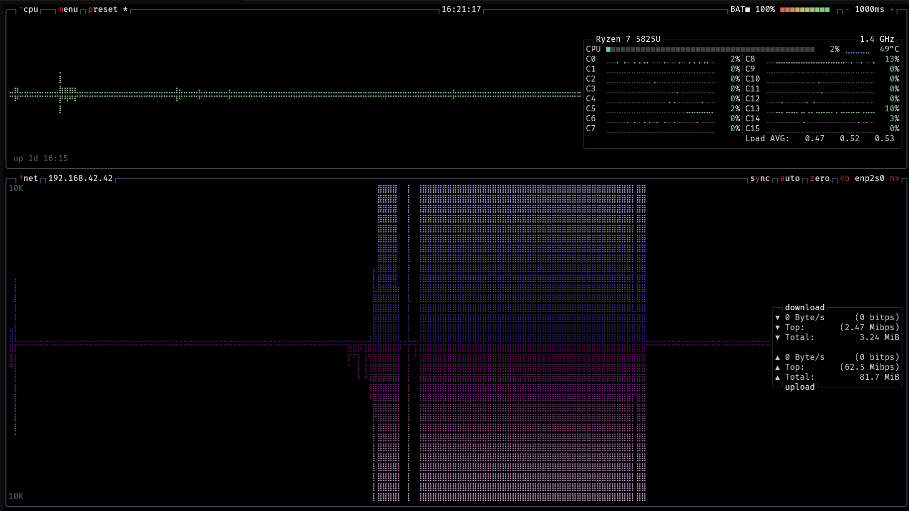
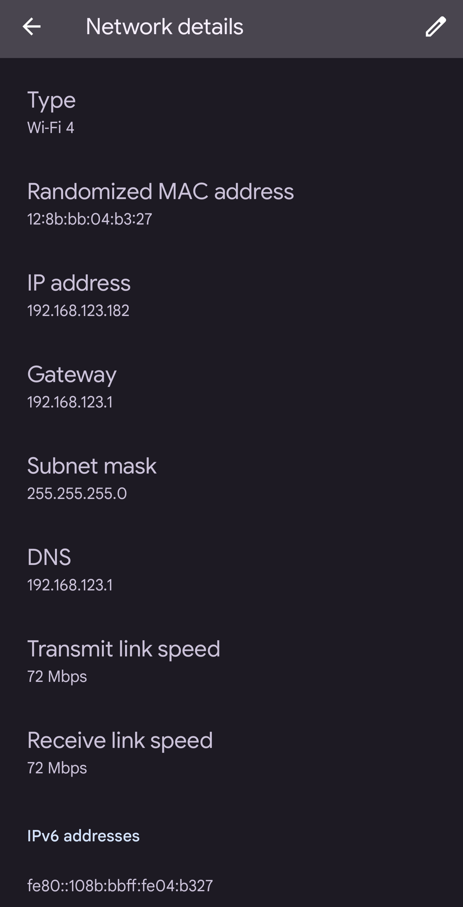

Der Pi wird durch anschließen des Stromkabels gestartet. Auf dem Hostrechner kann durch die Netzwerkauslastung am LAN-Port beobachtet werden, ob der TFTP-Server die Daten für den Raspberry Pi zur Verfügung stellt. Dafür geeignet sind Programme wie `btop`:
  
  
  
Des Weiteren kann der Output des Befehls `tail -f /var/log/syslog | grep tftp` Schlüsse auf die korrekte Funktionsweise des TFTP-Servers geben. 

Nachdem der Pi gestartet wurde kann versucht werden sich über SSH auf diesem einzuloggen.
Dabei wird als User `Panagou` und als IP-Adresse `192.168.42.69` angegeben. Wird die Verbindung erfolgreich aufgebaut, kann sich mit dem Passwort `Qbobhpv` eingeloggt werden.  
<br>  

```bash
nemdos@ThinkpadUbuntu ~ $ ssh Panagou@192.168.42.69
Panagou@192.168.42.69`s password: Qbobhpv 
```
<br> 
Nach dem Einloggen kann durch den Befehl `hostname` die Konfiguration des Hostnames überprüft werden.  
<br>  

```bash
$ hostname
lilibiti80 
```

### Konfiguration des Access-Points über den Raspberry Pi 4

In diesem Abschnitt wird die Konfiguration des Raspberry Pi 4 als Access-Point getestet. Diese umfasst:  
  
- Das erfolgreiche Aufspannen des WLAN-Netzes
- Den Namen und das Passwort des Netzes
- Der Adressraum des Netzes
- Die Konfiguration des `wlan0`-Interfaces

---

Durch aufrufen des Befehls `ifconfig wlan0` ist es möglich die Konfiguration des Interfaces einzusehen.  
<br>

```bash
$ ifconfig wlan0
wlan0     Link encap:Ethernet  HWaddr DC:A6:32:9B:B1:30  
          inet addr:192.168.123.1  Bcast:192.168.123.255  Mask:255.255.255.0
          inet6 addr: fe80::dea6:32ff:fe9b:b130/64 Scope:Link
          UP BROADCAST RUNNING MULTICAST  MTU:1500  Metric:1
          RX packets:0 errors:0 dropped:0 overruns:0 frame:0
          TX packets:12 errors:0 dropped:0 overruns:0 carrier:0
          collisions:0 txqueuelen:1000 
          RX bytes:0 (0.0 B)  TX bytes:936 (936.0 B)
```  
<br>  

Ob das WLAN-Netz korrekt aufspannt ist, lässt allerdings direkt mit dem Smartphone testen. Dazu wird mit diesem versucht sich mit dem Netz zu verbinden.  
Nach öffnen der WLAN-Einstellungen des Smartphone sollte das WLAN-Netz auswählbar und mittels des Passwortes `ancprcuuaq` nutzbar sein.  
  
In der Detailansicht der WLAN-Verbindung kann nun überprüft werden, ob der der AP des Pi korrekt Adressen aus dem Netz `192.168.123.0/24` verteilt.  
<br>  
{ height=500px }
<br>  

### Konfiguration des Gerätetreibers und Ansteuerung der LED

In diesem Abschnitt wird die Funktionalität und Ansteuerung der LED über den Gerätetreiber `signalan`. Dies beinhaltet:  
  
- Der Gerätetreiber wird während des Hochfahrens des Systems geladen
- Die Gerätedatei wird automatisch angelegt 
- Durch lesen des Gerätetreibers kann die aktuelle Blinkfrequenz der LED ausgelesen werden
- Durch schreiben des Gerätetreibers kann die aktuelle Blinkfrequenz der LED geändert werden 

---

Ob der Gerätetreiber erfolgreich geladen wurde, lässt sich einfach mittels des Befehls `lsmod` ermitteln. War das Laden erfolgreich, so wird der Gerätetreiber in der Ausgabe aufgelistet.  
<br>

```bash
$ lsmod
Module                  Size  Used by
signalan               12288  0
ipv6                  528384  32
```  
<br>  

Ähnliches Vorgehen kann das Anlegen der Gerätedatei überprüfen. Dazu wird der Befehl `ls /dev/ | grep led_onoff_an` verwendet. Dieser listet alle Gerätedateien des Systems auf und sucht darin nach der speziellen Gerätedatei. Falls die Gerätedatei nicht angelegt wurde, gibt dieser Aufruf nichts zurück.  
<br>

```bash
$ ls /dev/ | grep led_onoff_an
led_onoff_an
```  
<br>  

Um das Lesen und Schreiben auf der Gerätedatei testen zu können ist es notwendig sich mit dem root-User einzuloggen.   
<br>

```bash
$ su
Password: root
```  
<br>  

Nun kann die Frequenz der LED aus der Gerätedatei ausgelesen, anschließend geändert und abschließend erneut ausgelesen werden. Dabei sollte die LED an GPIO-Pin 23 des Raspberry Pi angeschlossen sein, um eine visuelle Bestätigung der Änderung der Blinkfrequenz bieten zu können.  
<br>

```bash
$ cat /dev/led_onoff_an 
1
$ echo -e -n "\x05" >/dev/led_onoff_an
$ cat /dev/led_onoff_an 
5
```  
<br>  

\pagebreak


## Test des Gesamtsystems

Nach den Tests der einzelnen Komponenten, folgt nun der Test des Gesamtsystems.  
Ziel dieses Tests ist es, festzustellen, ob alle Komponenten korrekt miteinander interagieren.  
Die Funktionalität der einzelnen Komponenten, wie dem Gerätetreiber und dem MQTT-Broker, müssen nicht nur in isolierten Tests, sondern auch im normalen Betrieb problemlos funktionieren.  
  
Das System ist wie in `Kapitel 4: Installationsanleitung` beschrieben aufgebaut und konfiguriert.  
  
- Die LED ist mit GPIO-Pin 23 verbunden
- Das aufgespannte WLAN-Netz trägt den Namen `VimIsTheBest` und vergibt Adressen aus dem Netz `192.168.123.0/24`
- Die MQTT-App ist zum Empfangen und Verschicken aller Topics korrekt konfiguriert

### Testdurchführung

Der Raspberry Pi 4 wird durch anschließen des Stromkabels eingeschaltet.  
Ob der Netzworkboot erfolgreich war, ist anhand der LED feststellbar.
Fängt diese nach dem Hochfahren an auf der niedrigsten Geschwindigkeit zu blinken, war das Booten per TFTP erfolgreich.  
   
Im nächsten Schritt wird die WLAN-Verbindung mit dem Smartphone hergestellt. Dazu wird das WLAN-Menü des Smartphones geöffnet und durch Antippen des Eintrags `VimIsTheBest` eine Verbindung hergestellt. Sobald die Verbindung aufgebaut wurde, kann die MQTT-App geöffnet werden.  
  
Auf dem Dashboard sollten nun alle Topics einsehbar sein. Im Folgenden kann nun getestet werden, ob durch versenden des Topics `appl/frequency_set` die Blinkfrequenz der LED gesteuert werden kann.

\pagebreak

# ...

\pagebreak

# Zusammenfassung

*Eine Zusammenfassung wiederholt *kurz* die Aufgabenstellung,
danach folgen die eigentlichen Inhalte und schließlich
wird das Ergebnis beschrieben.*

*Meistens gibt es noch einen kurzen Ausblick, was noch zu tun ist
beziehungsweise was noch getan werden kann.*
